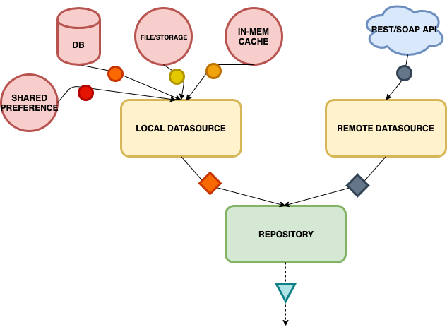
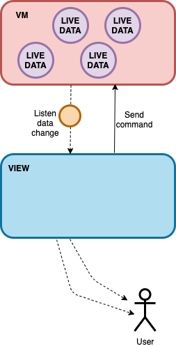
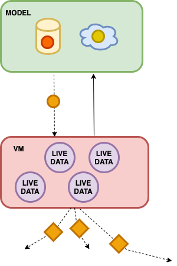

# Bitmark Standard Android Architecture

The Bitmark standard architecture for building Android application

## Getting Started

#### Prequisites

- Java 8
- Android 6.0 (API 23)

#### Preinstallation

Create `.properties` file for the configuration
- `sentry.properties` : uploading the Proguard mapping file to Sentry
```xml
defaults.project=bitmark-registry
defaults.org=bitmark-inc
auth.token=SentryAuthToken
```
- `key.properties` : API key configuration
```xml
api.key.bitmark=BitmarkSdkApiKey
api.key.intercom=IntercomApiKey
```
- `app/src/main/resources/sentry.properties` : Configuration for Sentry
```xml
dsn=SentryDSN
buffer.dir=sentry-events
buffer.size=100
async=true
async.queuesize=100
```
- `app/fabric.properties` : Configuration for Fabric distribution
```xml
apiSecret=FabricSecretKey
apiKey=FabricApiKey
```

Create `distribution` directory for distribution configuration
- release_note.txt : Release note for distribution
- testers.txt : list email of testers, separate by a comma

Add `release.keystore` and `release.properties` for releasing as production

## Documentation

### Architecture

This project is built in [MVVM](https://en.wikipedia.org/wiki/Model%E2%80%93view%E2%80%93viewmodel) architecture with partially [Android Jetpack](https://developer.android.com/jetpack) integration. 
We all so apply Repository pattern, DAO pattern for the persistence layer and Dependency Injection for project's object injection.

There are 3 main layers in this structure:
- Model: Data processor with all data logic inside, located in `/data` folder
- View: a.k.a `ViewController` that is `Activity/Fragment` where is responsible to manage the UI display.
- ViewModel: Bridge between View and Model, process view logic.

#### Model
Using `Repository` to mix, process data before expose to VM. 
Model does NOT hold any instances of View or ViewModel that make it as lowest level in the architecture.

Below is diagram that describe how data is processed in Model.




#### View
Control how the view is displayed and handle user interaction. 

- View holds instance of ViewModel and send command directly to it and listen to the data changed as well. 
- View does not connect directly with the Model, does not get pure data from it without via ViewModel. 
- View only has view-related component like app life-cycle handler, network change handler, etc... It does NOT contain any data logic component.



#### ViewModel
ViewModel bridge between Model and View, is responsible doing some view logic before sending notification to the View.

- ViewModel holds instance of Model, send command directly do Model and listen notification from that.
- ViewModel does NOT hold View instance. It just provide the channels to View that View can listen on data change from ViewModel.
- ViewModel does some data logic like transforming pure data from Model to ViewModel (a kind of view-related stuff) that help to display the UI then expose it to View.
- ViewModel holds some specific logic/data processor components.



### Dependency usage
- [Bitmark Java/Android SDK](https://github.com/bitmark-inc/bitmark-sdk-java) : Java-based SDK to work with Bitmark platform.
- [Room Android](https://developer.android.com/topic/libraries/architecture/room) : ORM database powered by Google.
- [Dagger Android](https://dagger.dev/) : DI library powered by Google.
- [RxJava 2/RxAndroid](https://github.com/ReactiveX/RxJava/wiki) : Reactive Programing library for Android/Java.
- [Sentry](https://docs.sentry.io/) : Crash report library.
- [Fabric Beta](https://docs.fabric.io/android/beta/overview.html) : Distribution library.

## Installation

`./gradlew clean fillSecretKey assembleInhouseDebug`

Using `-PsplitApks` to build split APKs

## Deployment
The debug build is distributed via ***Fabric Beta***

`./gradew crashlyticsUploadDistributionInhouseDebug`


## License

```SPDX-License-Identifier: ISC```

Copyright © 2014-2019 Bitmark. All rights reserved.

Use of this source code is governed by an ISC license that can be found in the [LICENSE](LICENSE) file.
